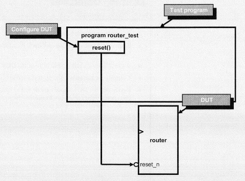
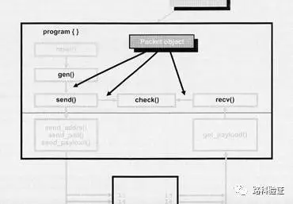

# luke_xidian_lab
路科验证西电课程实验

### lab1

实验内容

1、用SV给待测试模块（DUT）搭建最简单的测试平台（Testbench）

2、用SV写一个任务（Task）来重置（Reset）DUT

3、编译（Compile）和仿真（Simulate）这个SV程序

### lab2

实验内容

1、拓展lab1中的测试平台，从一个输入端向一个输出端发送数据包

2、用新的测试平台来编译和仿真设计文件

### lab3

实验内容

1、构造一个从路由器输出端进行取样的监视器（Monitor）

2、构造一个可以验证路由器输出的比较器（Checker）

3、运行Driver和Monitor程序，检验Checker能否正确比数

### lab4

实验内容

1、将数据信息封装进入Packet类中

2、利用随机化（randomization）在packet类中随机产生源地址，目标地址和payload。

3、创建两个packet对象（object），一个包用来在DUT输入端输入，另一个包用来和DUT输出的数据相参照。

4、将compare()方法嵌入packet类，用来验证DUT工作的正确性。